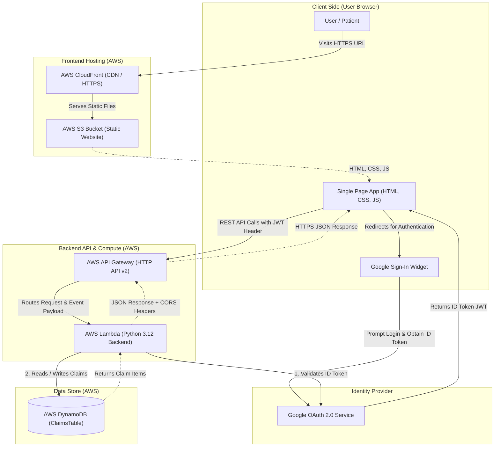

# System Architecture

This document describes the high-level architecture, component interactions, hosting setup, and authentication flow for the **ARAG Health Insurance Claims Tracker**.

---

## Architecture Diagram

The application uses a secure, cost-effective serverless architecture. Below is a diagram showing how components interact during a user session.

---

## Component Layers

### 1. Frontend Web Hosting (S3 + CloudFront)
* **AWS S3 (Simple Storage Service)**: Configured as a private bucket storing the static assets (`index.html`, `app.js`, `styles.css`). Public access to S3 is disabled directly to ensure security.
* **AWS CloudFront**: A Content Delivery Network (CDN) that acts as the entry point for the frontend. It provides:
  * **HTTPS Enforcement**: Serves the application over SSL/TLS using a CloudFront-managed certificate.
  * **Caching**: Distributes assets globally to reduce load times.
  * **Security**: Restricts access to the S3 bucket using an **Origin Access Control (OAC)** or **Origin Access Identity (OAI)**, ensuring users can only fetch assets via CloudFront.

### 2. Identity & Access Management (Google OAuth 2.0)
* **Google Identity Services (GIS) SDK**: Embedded directly in the frontend browser application. It displays the "Sign In with Google" button.
* **ID Token (JWT)**: Upon successful login, Google issues a signed JSON Web Token (JWT) representing the user. This token is stored in the browser's memory and sent as a `Bearer` token in the `Authorization` header of all subsequent API calls.
* **Backend Verification**: The AWS Lambda backend validates this token against Google's Tokeninfo API for each request, confirming:
  * The signature is valid.
  * The token has not expired.
  * The audience (`aud`) matches the application's configured `GOOGLE_CLIENT_ID`.
  * The user's email is present on the environment-defined allowed email list (`ALLOWED_EMAILS` or `TENANT_MAP`).

### 3. API Gateway (HTTP API v2)
* **AWS API Gateway (HTTP API)**: A lightweight, low-latency API gateway that handles CORS preflight requests (`OPTIONS` method) and forwards client HTTPS requests (`GET`, `POST`, `PUT`, `DELETE`) to the backend Lambda function.
* It routes requests from path `/claims` and `/claims/{id}` to the unified Lambda handler.

### 4. Compute Layer (AWS Lambda)
* **AWS Lambda**: Executes the Python 3.12 backend code. It uses an **on-demand execution model**, meaning it spins up in milliseconds when a request arrives and shuts down immediately after responding. This keeps costs at exactly $0.00 when the app is idle.
* **Zero-Dependency Architecture**: The backend uses Python's built-in standard libraries (like `urllib.request` for HTTPS token verification and `json` for formatting) instead of third-party packages. This keeps the deployment package extremely small, which:
  * Reduces **Cold Start** time (the time it takes for a new Lambda instance to bootstrap).
  * Simplifies maintenance (no dependency upgrades or security patching of third-party libraries).

### 5. Database Layer (Amazon DynamoDB)
* **Amazon DynamoDB**: A fully-managed, serverless NoSQL database configured in **Pay-Per-Request (On-Demand) billing mode** (meaning you pay only for read/write requests, with no hourly/monthly base cost).
* **Table Schema**: The table (`ClaimsTable`) uses a composite key to support multi-tenancy and efficient querying:
  * **Partition Key (`userId` - String)**: Represents the tenant identifier (derived from the user's Google email). This guarantees data isolation—users can only query records matching their `userId`.
  * **Sort Key (`id` - String)**: Represents the unique UUID of each claim.

---

## Core Flows

### Authentication & Token Verification Flow
1. User logs in using Google Sign-In in the browser.
2. The browser receives a JWT ID Token from Google.
3. For every API request (e.g., fetching claims), the browser places this token in the header:
   `Authorization: Bearer <ID_TOKEN>`
4. The Lambda function receives the request, extracts the token, and calls the Google verification endpoint:
   `https://oauth2.googleapis.com/tokeninfo?id_token=<ID_TOKEN>`
5. Google returns user metadata (name, email, avatar).
6. Lambda checks if the email is authorized in the backend environment configuration.
7. If authorized, Lambda extracts the `tenantId` (defaulting to the user's email) and proceeds with the database query.

### Data Read/Write Flow
* **Listing Claims**: Lambda executes a DynamoDB **Query** operation filtering by the `userId` partition key. This is highly efficient and secure, as DynamoDB returns only the records belonging to that user.
* **Writing/Updating Claims**: Lambda parses the JSON request body, converts floats to `Decimal` (required by DynamoDB), injects timestamps (`createdAt`, `updatedAt`), and calls DynamoDB's `put_item` API.
* **Deleting Claims**: Lambda calls DynamoDB's `delete_item` API using the partition key (`userId`) and sort key (`id`).
